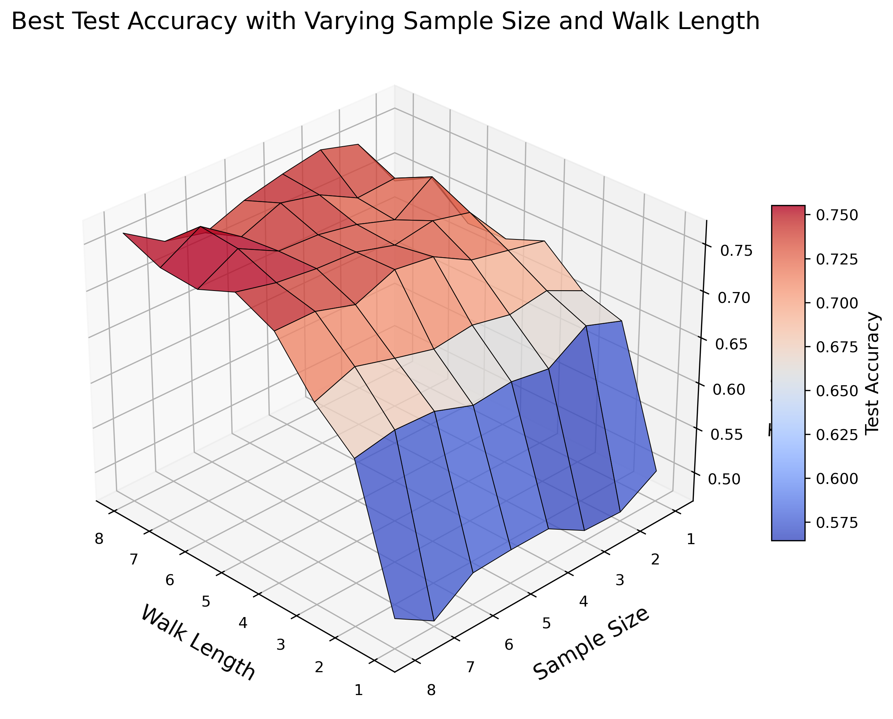

 # Non-Convolutional Graph Neural Networks (RUM Neural Network)

This repository implements the **Random Walk with Unifying Memory (RUM) Neural Network** as described in the paper:  
[Non-convolutional Graph Neural Networks](https://doi.org/10.48550/arXiv.2408.00165) by Yuanqing Wang and Kyunghyun Cho.

---

## 📚 Paper Overview

The RUM neural network offers a novel approach to graph learning by completely removing the need for convolution operators, addressing limitations such as:
- **Limited expressiveness**  
- **Over-smoothing**  
- **Over-squashing**  

RUM utilizes **random walks** combined with a **recurrent neural network (RNN)** to merge topological and semantic graph features. It is proven to be more expressive than the Weisfeiler-Lehman (WL) isomorphism test while being scalable, memory-efficient, and faster than convolutional GNNs.

---

## 🚀 Features

- **No convolutional operators**: Simplifies architecture and improves computational efficiency.
- **Random walk-based representation learning**: Leverages graph topology and semantic features.
- **Expressiveness**: Proven to outperform WL isomorphism tests.
- **Scalability**: Suitable for large graphs with efficient memory usage.

---

## 📂 Datasets

This implementation supports node-level and graph-level classification and regression tasks. Commonly used datasets include:
1. **Cora**
2. **Citeseer**
3. **PubMed**
4. **ZINC** (regression)

---

## 📊 Results

### Best Test Accuracy with Varying Sample Size and Walk Length

---

## 🛠 Libraries and Tools

The following libraries and tools are used:
- [Python 3.8+](https://www.python.org/)
- [PyTorch](https://pytorch.org/)
- [PyTorch Geometric](https://pytorch-geometric.readthedocs.io/)
- [SciPy](https://scipy.org/)

